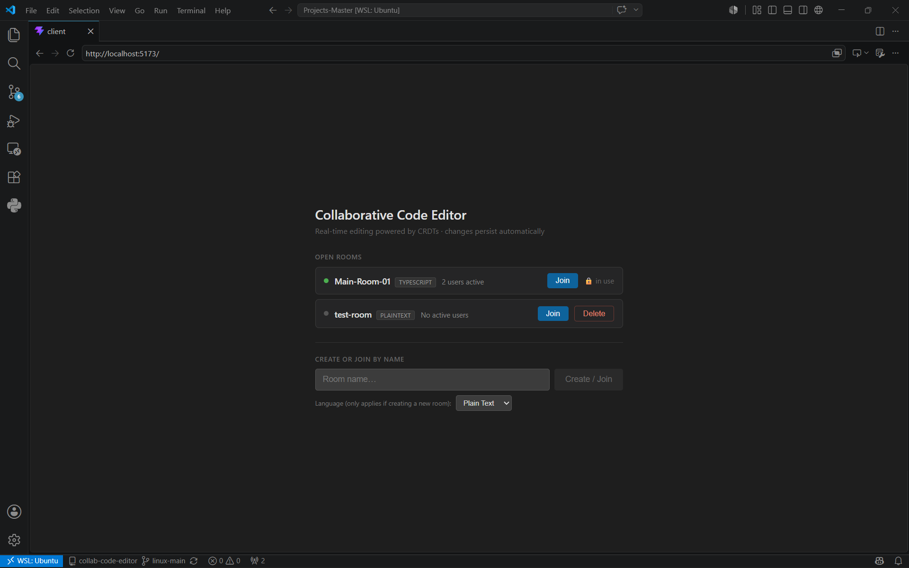
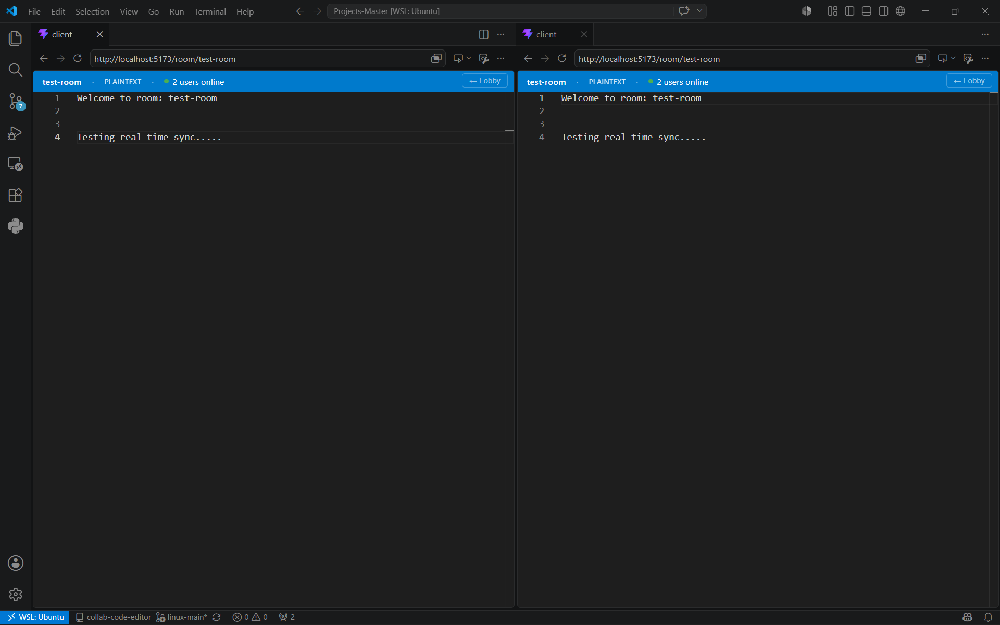

# Real-Time Collaborative Code Editor

A production-quality collaborative code editor with real-time multi-user editing powered by **Conflict-free Replicated Data Types (CRDTs)**. Changes sync instantly across all connected clients with no conflicts, and documents persist automatically through a layered Redis + SQLite storage architecture.


*Lobby showing live room list with active user counts*


*Editor view with real-time collaboration across multiple users*

---

## Live Demo

**[→ Try it live](http://129.146.100.26/)**

Hosted on Oracle Cloud (Ubuntu, Nginx reverse proxy, PM2 process management). Feel free to open it in two tabs and try editing the same room from both.

---

## Features

- **Real-time collaboration** — Multiple users edit the same document simultaneously with zero conflicts
- **CRDT-based sync** — Uses Yjs for mathematically guaranteed eventual consistency; no central lock or conflict arbiter needed
- **Live room lobby** — Browse active rooms with live user counts before joining; polls every 5 seconds
- **Multi-language support** — Rooms can be created as JavaScript, TypeScript, Python, Java, or Plain Text; the language is locked in at creation and applies to everyone who joins
- **Safe room deletion** — Permanently delete a room once it's empty, with a confirmation prompt warning to back up content first; blocked entirely while anyone is still active in it
- **Layered persistence** — Redis hot cache for sub-millisecond reads on join; SQLite for durable storage after 30 seconds of edit inactivity
- **Graceful shutdown** — Pending writes are flushed to SQLite on SIGINT/SIGTERM so no edits are lost
- **Monaco Editor** — Full VS Code editing experience with syntax highlighting per language
- **Modular TypeScript backend** — Service layer, repository pattern, and typed Socket.IO handlers throughout

---

## Architecture

```
┌──────────────────────────────────────────────────────────────┐
│                          Browser                             │
│                                                              │
│   ┌─────────────────┐        ┌──────────────────────────┐    │
│   │   Lobby Page    │        │       Editor Page        │    │
│   │  (Room List)    │        │  Monaco + Yjs CRDT       │    │
│   └────────┬────────┘        └────────────┬─────────────┘    │
│            │ REST GET/DELETE /api/rooms   │ WebSocket (Yjs)  │
└────────────┼──────────────────────────────┼──────────────────┘
             │                              │
             ▼                              ▼
┌──────────────────────────────────────────────────────────────┐
│                      Node.js / Express                       │
│                                                              │
│   ┌──────────────┐      ┌───────────────────────────────┐    │
│   │  REST API    │      │         Socket.IO             │    │
│   │ /api/rooms   │      │  roomHandler · docHandler     │    │
│   └──────┬───────┘      └──────────────┬────────────────┘    │
│          │                             │                     │
│   ┌──────▼─────────────────────────────▼─────────────────┐   │
│   │                 Service Layer                        │   │
│   │   RoomService · DocumentService · PersistenceService │   │
│   └──────┬─────────────────────────────┬─────────────────┘   │
│          │                             │                     │
│   ┌──────▼───────┐         ┌───────────▼──────────────┐      │
│   │  Repository  │         │       Repository         │      │
│   │    Redis     │         │        SQLite            │      │
│   └──────────────┘         └──────────────────────────┘      │
└──────────────────────────────────────────────────────────────┘
             │                             │
    ┌────────▼────────┐         ┌──────────▼───────────┐
    │      Redis      │         │       SQLite         │
    │   (Hot Cache)   │         │  (Durable Storage)   │
    │  · Yjs state    │         │  · Full Yjs snapshot │
    │  · Room index   │         │  · Flushed on idle   │
    │  · Language     │         │  · Language          │
    └─────────────────┘         └──────────────────────┘
```

### Document Persistence Flow

```
User types
    │
    ▼
Yjs CRDT update generated (client)
    │
    ├──► Broadcast to all peers via Socket.IO
    │
    └──► Server applies update to in-memory Yjs doc
              │
              ├──► Write to Redis immediately   (hot cache)
              │
              └──► Reset 30s idle timer
                        │
                   [30s of silence]
                        │
                        ▼
                   Flush to SQLite           (durable store)
```

---

## Tech Stack

| Layer | Technology |
|---|---|
| Frontend | React 18, TypeScript, Vite |
| Editor | Monaco Editor (`@monaco-editor/react`) |
| CRDT | Yjs, y-monaco |
| Real-time | Socket.IO (WebSocket transport) |
| Backend | Node.js, Express, TypeScript |
| Hot Cache | Redis |
| Durable Store | SQLite (`better-sqlite3`) |

---

## Project Structure

```
project/
├── client/                          # React frontend
│   └── src/
│       ├── components/
│       │   ├── CollaborativeEditor.tsx   # Monaco + Yjs binding
│       │   ├── RoomList.tsx              # Active rooms display + delete control
│       │   └── RoomForm.tsx              # Create / join input + language picker
│       ├── hooks/
│       │   ├── useCollaboration.ts       # Yjs doc lifecycle + socket sync
│       │   └── useRooms.ts               # REST polling for lobby + delete calls
│       ├── pages/
│       │   ├── Lobby.tsx                 # Room browser page
│       │   └── EditorPage.tsx            # Editor route wrapper
│       ├── services/
│       │   └── socketService.ts          # Typed Socket.IO singleton
│       ├── types/
│       │   └── index.ts                  # Shared types + language options
│       └── App.tsx                       # Router root
│
└── server/                          # Node.js backend
    └── src/
        ├── config/
        │   ├── redis.ts                  # Redis connection singleton
        │   └── database.ts               # SQLite setup + schema migration
        ├── models/
        │   └── types.ts                  # Shared TypeScript interfaces (rooms, documents, language)
        ├── repositories/
        │   ├── RedisRepository.ts        # All Redis I/O
        │   └── DatabaseRepository.ts     # All SQLite I/O
        ├── services/
        │   ├── DocumentService.ts        # Yjs doc lifecycle + cache hierarchy
        │   ├── RoomService.ts            # Active connection tracking + lobby
        │   └── PersistenceService.ts     # Debounced idle-flush scheduler
        ├── socket/
        │   ├── handlers/
        │   │   ├── roomHandler.ts        # join-room / leave-room events
        │   │   ├── documentHandler.ts    # yjs-update events
        │   │   └── connectionHandler.ts  # disconnect cleanup
        │   └── index.ts                  # Socket.IO server factory
        ├── routes/
        │   └── roomRoutes.ts             # GET /api/rooms · DELETE /api/rooms/:id
        ├── app.ts                        # Express app factory
        └── index.ts                      # Entry point + graceful shutdown
```

---

## Prerequisites

Before running the project, make sure you have the following installed:

- **Node.js** v18 or higher — [nodejs.org](https://nodejs.org)
- **npm** v9 or higher (comes with Node.js)
- **Redis** — either installed locally or via Docker

Verify your versions:

```bash
node --version    # should be v18+
npm --version     # should be v9+
redis-cli ping    # should respond with PONG if Redis is running
```

---

## Getting Started

### 1. Clone the repository

```bash
git clone https://github.com/rutul6024us-droid/collab-code-editor.git
cd collab-editor
```

### 2. Start Redis

**Option A — Docker (recommended, no local install needed):**

```bash
docker run -d --name collab-redis -p 6379:6379 redis:alpine
```

**Option B — Local install on Ubuntu / WSL:**

```bash
sudo apt install redis-server
sudo service redis-server start
```

**Option B — Local install on macOS:**

```bash
brew install redis
brew services start redis
```

Confirm Redis is running:

```bash
redis-cli ping   # Expected: PONG
```

### 3. Set up the server

```bash
cd server
npm install
cp .env.example .env
```

The default `.env` works out of the box if Redis is on `localhost:6379`. Open it if you need to change any values:

```env
PORT=3001
REDIS_URL=redis://localhost:6379
DB_PATH=./data/editor.db
IDLE_TIMEOUT_MS=30000
CORS_ORIGIN=http://localhost:5173
```

### 4. Set up the client

Open a new terminal tab:

```bash
cd client
npm install
cp .env.example .env
```

The default `.env` points to the server at `localhost:3001`:

```env
VITE_SERVER_URL=http://localhost:3001
```

### 5. Run the server

In the server terminal:

```bash
npm run dev
```

You should see:

```
[Redis] Connected successfully.
[Database] SQLite ready at ./data/editor.db
[Server] Listening on http://localhost:3001
```

### 6. Run the client

In the client terminal:

```bash
npm run dev
```

You should see:

```
VITE v8.x.x  ready in Xms
➜  Local:   http://localhost:5173/
```

### 7. Open the app

Navigate to **http://localhost:5173** in your browser.

To test real-time collaboration, open the same URL in a second browser tab or window. Create a room from one tab and join it from the other — edits will sync in real time.

---

## Usage Notes

### Choosing a room's language

When creating a new room, pick a language from the dropdown in the lobby: JavaScript, TypeScript, Python, Java, or Plain Text. That choice is locked in permanently for that room the moment it's created — every subsequent person who joins gets the same language, and there's no way to change it afterward (a deliberate simplification; see the comments in `DocumentService.ts` for why). Joining a room that already exists ignores whatever language you had selected, since the room's original language always wins.

### Deleting a room

Each room in the lobby has a Delete option, but it's only ever available when the room is completely empty — if anyone is currently active in it, the button is replaced with a small "in use" indicator instead of being merely disabled, so there's nothing to accidentally click. Deleting is permanent: it wipes the room's content from memory, Redis, and SQLite in one shot, and the confirmation prompt exists specifically to remind you to copy anything worth keeping first.

---

## Running the Latency Benchmark (Optional)

A custom Node.js load-test script is included to benchmark WebSocket propagation latency under concurrent load.

```bash
cd benchmark
npm install
node latency-bench.js http://localhost:3001 50 200
```

This connects 50 simultaneous clients to the server, syncs all of them via Yjs, then fires 200 timed ping-pong messages and reports round-trip latency percentiles (p50, p95, p99).

---

## Environment Variables

### Server (`server/.env`)

| Variable | Default | Description |
|---|---|---|
| `PORT` | `3001` | HTTP server port |
| `REDIS_URL` | `redis://localhost:6379` | Redis connection URL |
| `DB_PATH` | `./data/editor.db` | Path to SQLite database file |
| `IDLE_TIMEOUT_MS` | `30000` | Milliseconds of inactivity before flushing to SQLite |
| `CORS_ORIGIN` | `http://localhost:5173` | Allowed CORS origin |

### Client (`client/.env`)

| Variable | Default | Description |
|---|---|---|
| `VITE_SERVER_URL` | `http://localhost:3001` | Backend server URL |

---

## How CRDTs Work Here

Traditional collaborative editors use **Operational Transformation (OT)**, which requires a central server to serialize and transform every concurrent operation — a bottleneck that becomes complex at scale.

This editor uses **Yjs**, a high-performance CRDT library. Each client maintains its own copy of the document as a Yjs `Y.Doc`. When a user types, Yjs generates a compact binary **update** representing the change. That update is:

1. Sent to the server via Socket.IO
2. Applied to the server's copy of the `Y.Doc`
3. Broadcast to all other clients in the room
4. Applied to each peer's local `Y.Doc`

Because CRDTs are designed so that **applying the same set of updates in any order always produces the same result**, no central arbitration or transformation is needed. Concurrent edits from multiple users converge to an identical document on every client automatically.

---

## License

MIT